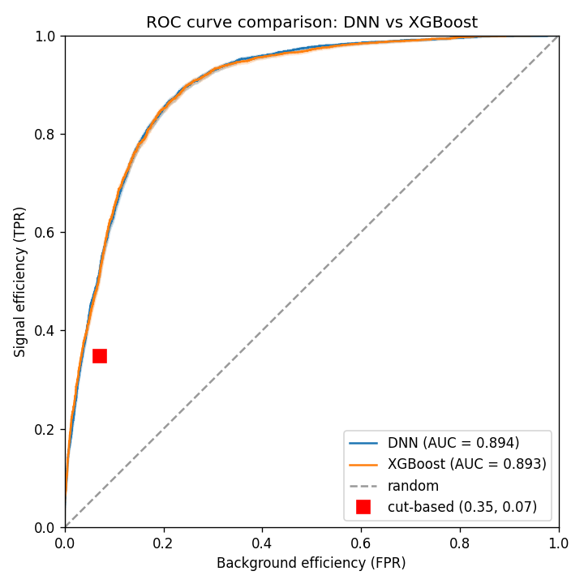
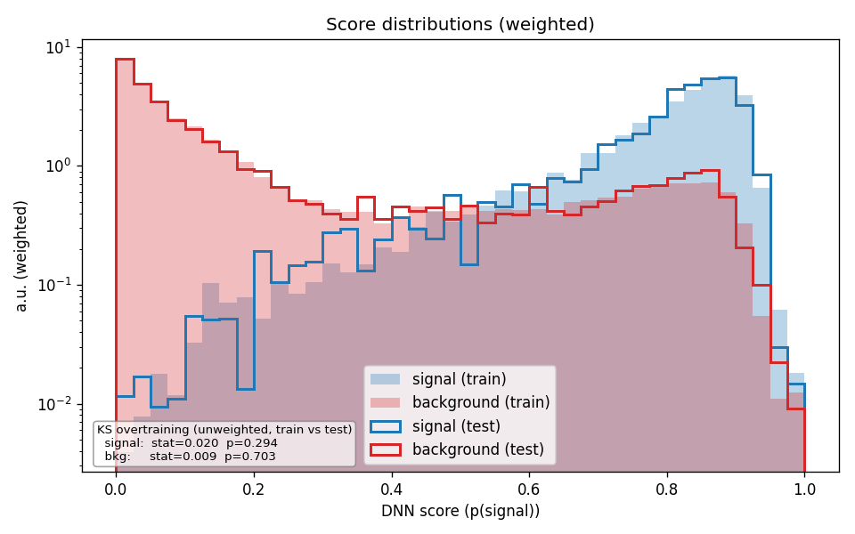
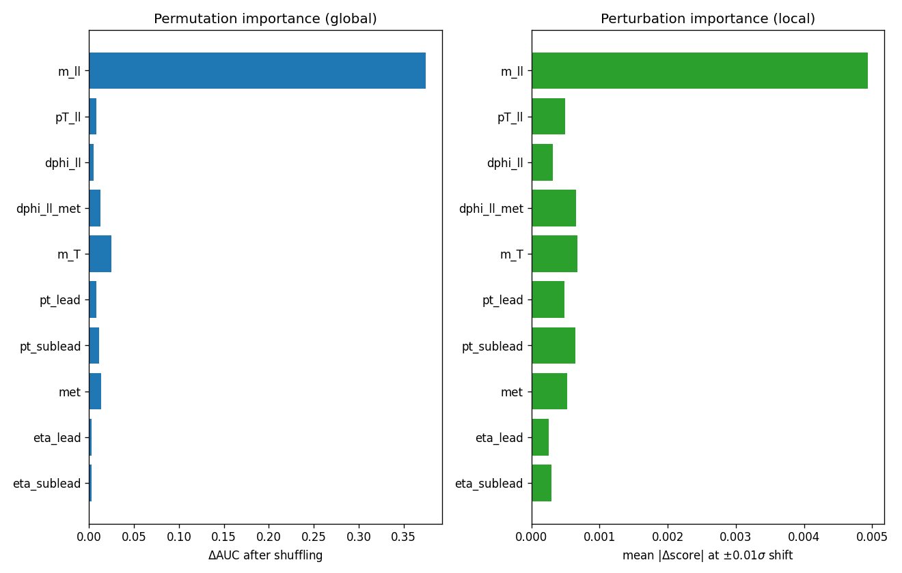

# atlas-classifier

`PyTorch · XGBoost · Optuna · uproot/awkward · scikit-learn · pytest`

End-to-end binary classifier for **ATLAS Open Data H→WW→2lνν** events in the 0-jet category. The 0-jet signal region has no reconstructable invariant mass (two neutrinos in the final state), so the classifier *is* the analysis selection — not a supporting filter on top of one. The goal is a measurable improvement over a hand-crafted cut-based baseline, validated across two independent model families (PyTorch DNN and XGBoost).

The pipeline goes from ATLAS Open Data ROOT ntuples → engineered physics features → trained classifier → quantitative significance comparison vs. the cut-based baseline, with full evaluation diagnostics: ROC with binomial confidence bands, KS overtraining check, weighted score distributions, and two complementary feature-importance methods.

> Developed using Claude Code; `CLAUDE.md` contains the technical context file for AI-assisted sessions.

---

## Results

On the held-out test set (15% of 72,635 events after loose preselection):

| | Cut-based baseline | DNN (V4) | XGBoost (V5) |
|---|---|---|---|
| AUC | — | 0.894 | 0.893 |
| Asimov Z (optimal threshold) | 5.85σ | **7.08σ** | **7.33σ** |
| ΔZ over cut-based baseline | — | **+1.23σ** | **+1.47σ** |
| KS overtraining p-value (sig / bkg) | — | 0.29 / 0.70 | — |

Asimov significance is the expected discovery significance under the signal hypothesis (Cowan et al. 2011, Eq. 97; reduces to S/√B in the s ≪ b limit but handles the s ~ b regime correctly — what ATLAS publications report). Yield-based numbers use the full physics weight (`xsec × luminosity × mcWeight × scale-factors`); ROC and KS are unweighted.





**Why the two classifiers tie, and why both beat the cut-based baseline.** A trained binary classifier outputs `p(signal | x)`, which by Bayes' theorem is monotonic in the likelihood ratio `L(x | signal) / L(x | background)`. The Neyman–Pearson lemma states that the likelihood ratio is the most powerful test statistic for distinguishing two hypotheses — so any well-trained classifier approximates the same theoretical optimum, and any optimum exceeds what hand-crafted cuts can achieve at the same dataset size. The +1.23σ / +1.47σ gain over cuts is the empirical demonstration; the near-identical AUC across two very different model families confirms it. The slight Z advantage of XGBoost is a score-shape effect at the optimal operating point, not a fundamental capability difference.

---

## Methodology evolution

The diagnostic process matters more than any single result. This is the V1→V4 progression for the DNN, with what each iteration revealed:

| Version | Selection | Features | AUC | ΔZ (fixed 30% WP) | ΔZ (optimal threshold) |
|---|---|---|---|---|---|
| V1 | Inclusive (ee/μμ + eμ) | 5 composite | 0.890 | +1.15σ | not measured |
| V2 | eμ only + Run 2 SR cuts | 5 composite | 0.700 | −1.30σ | not measured |
| V3 + HPO | eμ only + Run 2 SR cuts | 10 features | 0.710 | −0.90σ | **+1.05σ** |
| V4 | eμ only + loose preselection | 10 features | 0.894 | — | **+1.23σ** |

**V1 → V2: physics-motivated tightening.** V1 used a broad selection (any opposite-sign 2-lepton 0-jet event, both same-flavour ee/μμ and different-flavour eμ) and showed a respectable +1.15σ improvement over the baseline. V2 cross-referenced against the [ATLAS Run 2 H→WW legacy analysis](https://arxiv.org/abs/2504.07686) and applied that paper's 0-jet signal region cuts: different-flavour leptons only (eμ, to suppress Z→ll), MET > 20 GeV, m<sub>ll</sub> < 55 GeV, Δφ<sub>ll,MET</sub> > π/2. The dataset shrank from ~173k to ~21k events, AUC collapsed from 0.890 to 0.700, and the DNN appeared to underperform the baseline by 1.3σ.

**Diagnosis.** Permutation importance showed Δφ<sub>ll</sub> had collapsed from +0.395 (V1) to +0.0003 (V2). The tight pre-cuts had pre-applied the strongest discriminants — m<sub>ll</sub> and Δφ<sub>ll,MET</sub> — leaving the DNN in a restricted phase space where signal and background looked similar. Adding raw lepton kinematics for V3 (lep_pt, lep_η, MET as standalone features) recovered marginal AUC but didn't close the gap.

**The threshold insight.** Up through V3, all results were reported at a fixed 30% signal-efficiency working point — an arbitrary historical choice. Scanning all ROC thresholds revealed that V3 actually beat the cut-based baseline by **+1.05σ at the optimal threshold**: the apparent underperformance was the fixed working point, not the classifier. Asking "is this WP doing useful work?" was the inflection point. The classifier was already working; the constraint was data volume after the tight pre-cuts.

**V4: counting experiment, loose preselection.** The Run 2 paper applies tight pre-cuts because it uses a *shape fit* on the DNN score, where the cuts define the fit region and any variable used in training cannot also be the fit variable (training would sculpt the post-cut background distribution and invalidate the fit). This pipeline uses an *Asimov counting experiment* at an optimal score threshold — the score cut *is* the selection — so the pre-cuts only restrict training data unnecessarily. Removing m<sub>ll</sub> < 55 and Δφ<sub>ll,MET</sub> > π/2 grew the dataset from 21k to 73k events (50,844 training events, vs. ~14k in V3) and recovered the full discriminating power: AUC = 0.894, ΔZ = +1.23σ.

**V5: XGBoost benchmark.** Same features, same train/val/test split, separate Optuna HPO. AUC = 0.894 (tie with the DNN); Asimov Z slightly higher (+1.47σ vs. +1.23σ). The +1σ-class improvement over the cut-based baseline is real and reproducible across model families.

---

## Features and physics motivation

Ten input features per event: five physics-motivated composite kinematic variables and five raw single-object measurements.

| Feature | Type | Definition | Physics motivation |
|---|---|---|---|
| `m_ll` | composite | dilepton invariant mass | Higgs spin-0 → low-mass tail; WW kinematic edge near m<sub>W</sub> |
| `pT_ll` | composite | dilepton system pT | Higgs recoil structure |
| `dphi_ll` | composite | Δφ between leptons | spin-0 Higgs → collinear leptons (small); WW → back-to-back (large) |
| `dphi_ll_met` | composite | Δφ between dilepton system and MET | signal / WW / top topology separation |
| `m_T` | composite | `√(2·pT_ll·MET·(1−cos Δφ_ll,MET))` | primary cut-based discriminant; kinematic edge at m<sub>W</sub> for backgrounds, extends to m<sub>H</sub> for signal |
| `lep_pt_lead` | raw | leading lepton pT | direct kinematic information |
| `lep_pt_sublead` | raw | sub-leading lepton pT | direct kinematic information |
| `met` | raw | missing transverse energy | direct kinematic information |
| `lep_eta_lead` | raw | leading lepton η | acceptance / topology |
| `lep_eta_sublead` | raw | sub-leading lepton η | acceptance / topology |

`m_T` is included as a DNN input even though it is the primary cut-based discriminant. For a counting experiment this is fine; for a shape fit on the m<sub>T</sub> distribution it would not be — training on the fit variable sculpts the post-classifier shape and invalidates the fit. General rule: exclude a variable from training if your inference depends on the shape of its distribution after the classifier cut.



**Finding: m<sub>ll</sub> dominance.** Permutation importance shows m<sub>ll</sub> dominates by a factor of ~15 over the next feature (+0.374 vs. +0.025 for m<sub>T</sub>). This makes physical sense: a spin-0 Higgs produces collinear leptons with simultaneously small Δφ<sub>ll</sub> and small m<sub>ll</sub> — the same physics shows up in both, so once m<sub>ll</sub> is in the network Δφ<sub>ll</sub> adds little marginal discriminating information. Verifying that the model's most important feature aligns with the underlying physics is a necessary correctness check; if m<sub>ll</sub> *hadn't* dominated, that would have been the bug to investigate.

---

## Pipeline

```
1. Download (scripts/download_data.py)
   8 ROOT files (6 H→WW production modes + WW + tt̄), atlasopenmagic-driven.
2. Load (src/data_loading.py → data/processed/events.h5)
   uproot iterates in 100 MB chunks; selection cuts applied via the YAML cut DSL;
   per-event physics weight computed; structured numpy → HDF5.
3. Preprocess (src/preprocessing.py → data/processed/split.h5)
   Compute the 10 features; 70/15/15 stratified split; RobustScaler stats from
   train split only.
4. (Optional) Tune (scripts/tune.py)
   Optuna TPE search over hidden_sizes / dropout / learning rate / batch size.
5. Train (src/train.py → data/processed/best_model.pt)
   BCEWithLogitsLoss + pos_weight; Adam + ReduceLROnPlateau + early stopping.
6. Evaluate (src/evaluate.py)
   ROC + Clopper–Pearson bands; weighted score distributions; KS overtraining;
   permutation + perturbation importance; threshold scan for optimal Asimov Z
   and cut-TPR-matched Z.
7. (Optional) XGBoost benchmark (scripts/xgboost_compare.py)
   Same features, same split; separate HPO; ROC comparison plot.
```

| Artifact | Producer | Contents |
|---|---|---|
| `data/raw/mc_<DSID>.root` | `download_data.py` | Raw ATLAS Open Data ntuples |
| `data/processed/events.h5` | `data_loading.py` | Selected events as flat per-event scalars + `event_weight` + `is_signal`. Composite features are *not* stored here. |
| `data/processed/split.h5` | `preprocessing.py` | Raw feature matrix, labels, and weights for each split + train-only scaler stats |
| `data/processed/best_model.pt` | `train.py` | Weights + in-model normalisation (`register_buffer`) + feature schema. Self-describing for inference. |

---

## Key design decisions

### Weight handling: counts in the loss, physics weights in evaluation

Signal events are rare by construction (small cross section). Naively passing the full physics weight (`xsec × luminosity × mcWeight × scale-factors`) to `BCEWithLogitsLoss` would suppress signal contributions to gradient updates and produce a classifier that predicts background everywhere. Instead:

| Stage | Weighting |
|---|---|
| Class balance in the loss | `pos_weight = n_background / n_signal` from event **counts** (no physics rates) |
| Per-event loss weighting | none |
| Yield estimates / significance / weighted plots | full `event_weight` |

Heuristic: if including a weight changes the relative balance between signal and background, keep it out of training. Physics weights belong where physics yields belong — in evaluation.

### `RobustScaler` (median ± IQR) over `StandardScaler`

HEP kinematic distributions are heavy-tailed (pT, mass). Mean and standard deviation are pulled by outliers; median and inter-quartile range are not. Small but real impact on training stability with extreme-pT events.

### In-model normalisation via `register_buffer`

Median and IQR live as non-parameter tensors *inside* the model, registered via `register_buffer`. They move with `.to(device)` and are saved in the checkpoint automatically. The `.pt` file is fully self-describing for inference: no external scaler-stats sidecar is required, and the saved `feature_names` attribute catches feature-order mismatches at load time.

### Asimov significance, not S/√B

S/√B is a small-signal approximation. The Asimov formula `Z = √(2·[(s+b)·log(1+s/b) − s])` (Cowan et al. 2011, Eq. 97) handles the s ~ b regime correctly and is what ATLAS publications report. Reduces to S/√B when s ≪ b. One extra line of code, more defensible number.

### Two complementary feature-importance methods

Permutation importance (global) shuffles each feature across the test set and measures the AUC drop. Perturbation importance (local) shifts each feature by ±0.01σ at each event's actual value and measures the mean |Δscore|. They measure different things — global discrimination quality vs. local gradient sensitivity — and reporting both makes disagreements interpretable: a feature that ranks high on perturbation but low on permutation suggests sharp local gradients in a region that doesn't contribute much global separation.

---

## Reproducing the results

The pipeline runs end-to-end in well under 10 minutes on Apple Silicon (~5 min download, ~5 min training, everything else in seconds).

### 1. Set up the Python environment

```bash
conda create -n atlas-classifier python=3.12 -y
conda activate atlas-classifier
pip install -r requirements.txt
```

PyTorch's MPS backend is used automatically on Apple Silicon; CUDA if available; otherwise CPU.

### 2. Download the ATLAS Open Data ROOT files (~2.5 GB, idempotent)

```bash
python scripts/download_data.py
```

Discovers the 8 samples (6 H→WW production modes + WW + tt̄, **2to4lep** skim of the **2025e-13tev-beta** release) via `atlasopenmagic` and saves them to `data/raw/mc_<DSID>.root`. Pass `--force` to re-download.

### 3. ROOT → HDF5 conversion (~10 s)

```bash
python src/data_loading.py
```

### 4. Feature engineering and 70/15/15 split (<1 s)

```bash
python src/preprocessing.py
```

### 5. (Optional) Hyperparameter optimisation (~10 min for 60 trials)

```bash
python scripts/tune.py --n-trials 60
```

Optuna TPE search over architecture, dropout, learning rate, and batch size. The best trial's checkpoint and history are promoted in place so step 6 picks up the winner without further config edits; the best params are also logged for paste-into-`config.yaml`.

### 6. Train the DNN (~5 min on M1 Max)

```bash
python src/train.py
```

### 7. Evaluate

```bash
python src/evaluate.py
```

Outputs to `data/processed/eval/`:
- `features_signal_vs_background.png` — per-feature distributions, signal vs. background
- `feature_correlation.png` — correlation heatmap on signal events
- `training_curves.png` — twin-axis val loss + val Asimov Z per epoch
- `roc.png` — ROC with Clopper–Pearson 1σ bands; cut-based WP overlaid
- `score_distributions.png` — weighted scores, train (filled) vs. test (line)
- `feature_importance.png` — permutation and perturbation importance side-by-side

### 8. (Optional) XGBoost benchmark (~90 s including HPO)

```bash
python scripts/xgboost_compare.py
```

Same split, same features. Produces `data/processed/eval/roc_comparison.png` overlaying the DNN and XGBoost ROCs against the cut-based baseline.

### 9. Run the test suite

```bash
pytest tests/ -v
```

42 tests covering the cut DSL evaluator, Asimov significance + threshold yield helpers + Clopper–Pearson intervals, Δφ wrapping, m<sub>T</sub> formula, stratified-split correctness, train-only scaler fit, model forward shape and logit semantics, BCE numerical stability, and constructor validation.

---

## Repository layout

```
atlas-classifier/
├── config.yaml              # Single source of truth for hyperparameters + cut DSL
├── notes/data_sources.md    # DSID table, weight formula, sample selection rationale
├── src/
│   ├── config.py            # TrainingConfig dataclass + YAML loader, type aliases
│   ├── sample_info.py       # SAMPLES registry (DSIDs + is_signal labels)
│   ├── utils.py             # asimov_significance, compute_yields, clopper_pearson,
│   │                        # evaluate_cuts (cut DSL), chronomat, setup_logging
│   ├── data_loading.py      # ROOT (uproot) → HDF5 with selection + weights
│   ├── preprocessing.py     # 10-feature engineering + stratified split + scaler stats
│   ├── model.py             # HWWClassifier (in-model RobustScaler, raw-logit output)
│   ├── train.py             # Manual training loop with early stopping + LR scheduling
│   └── evaluate.py          # Full evaluation suite + threshold scan
├── scripts/
│   ├── download_data.py     # atlasopenmagic-driven ROOT download
│   ├── tune.py              # Optuna TPE hyperparameter search
│   ├── xgboost_compare.py   # XGBoost benchmark with separate HPO
│   └── inspect_h5.py        # Quick HDF5 structure dump
├── tests/                   # pytest suite (42 tests)
├── assets/                  # Plots embedded in this README
├── data/raw/                # ROOT files (gitignored)
├── data/processed/          # HDF5 + checkpoint + plots (gitignored)
└── logs/                    # training.log, tune.log, xgboost_compare.log (appended)
```

---

## Scope of v1

Out-of-scope by design:

- **Systematic uncertainties.** The Education-and-Outreach data tier doesn't expose per-event systematic variations as branches; treating them properly requires re-running with separate systematics ROOT files.
- **Background normalisation factors from control regions.** Real ATLAS analyses fit MC normalisations from data sidebands; this pipeline uses luminosity weights only.
- **Real collision data.** ATLAS Open Data includes real pp collision data alongside the MC, but this pipeline trains and evaluates on MC only. Significance is computed entirely from MC yields using the Asimov approximation (treating the MC prediction as a stand-in for data) — standard practice for feasibility studies and classifier development before unblinding.
- **Backgrounds beyond WW + tt̄.** Z→ττ contributes ~1% in the 0-jet region after full selection per the Run 2 paper; data-driven fakes are not included.

**On comparability with the Run 2 legacy analysis.** The results here are not directly comparable to [arXiv:2504.07686](https://arxiv.org/abs/2504.07686): this pipeline uses a simplified Open-Data MC tier (no systematics, no NF/CRs), a simpler statistical treatment (Asimov counting at an optimal score threshold vs. profile-likelihood shape fit on the DNN score), a restricted background palette, and a looser preselection. The aim of this repository is to demonstrate end-to-end ML pipeline capability and the Neyman–Pearson improvement over hand-crafted cuts on a real HEP topology — not to reproduce the published result.
